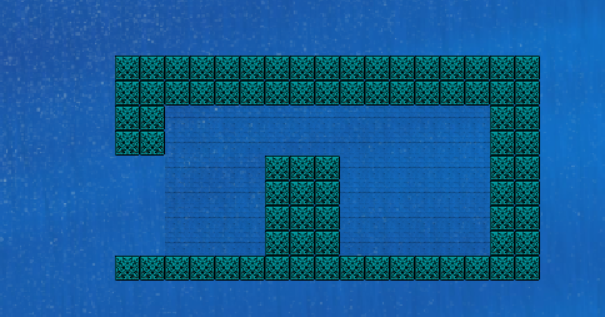

# Submerged City

`Movement of Player`

`⬆️` : To swim up

`⬇️` : To swim down

`➡️` : To swim right

`⬅️` : To swim left

`Getting health points`

`h` : If you press `h` key and you have enough coins then you can get **health points** in exchange of **10 coins** coins.

`Level 1 play`

In level one the fishes will stay still for upto 5 secs, and then they will start following user, 
but if the user is in **safe zone** the fishes will stay go back, and surroud the gate(**passage to the next level**)

* You can accumulate bombs by getting close to icon .
* if the fishes catches the user, user's health will degrade by **0.5** points.
* If you manage to get to the passage, you will advance your level.
* You will get **20** coins for killing each fish.
* You can safe yourself getting inside of **safe area**.
* You can collect coins getting closer to coin icon 
  
`Safe Area 👇👇`

`Level 2 play`

In this level you might find it surplus bombs and treasures comparing to what you need to **advance** from this level, but this is not true, as amount of surplus **treasures**(new in this level), bombs in this level, will be useful to play next level.

* coins collection is similar to **Level 1**
* bombs accumulation similar to **Level 1**
* If you manage to get to the passage, you will advance your level.
* Your health point will degrade if you get closer to white grass.
* If you collect treasure you will get 500 coins.
* if you get closer to **red brick**, it will blast in two sec, and your health will degrade propotional to distance to the **red brick**
* If you get closer to gate(passage to next level), rotating blades will start following you,
* Each **collision with blade** will degrade your health by **1** points

Treasure img 👇👇 

Blades👇👇 

Red bricks 👇👇

White grass area 👇👇 

